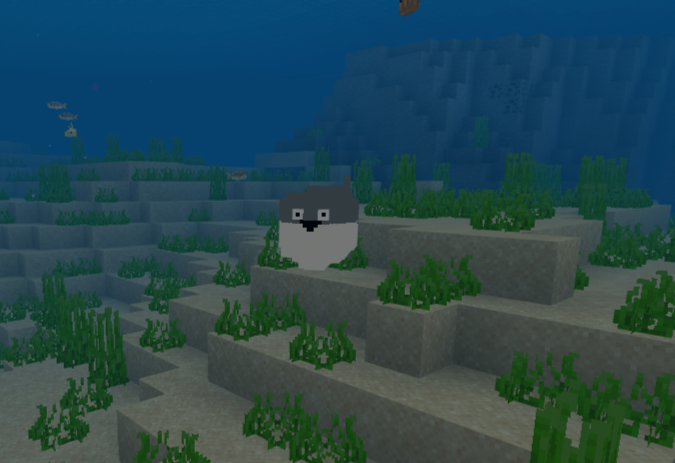

# Minecraft Sacabambaspis-Addon

## このアドオンについて

- マインクラフトにサカバンバスピスを追加する。
- 追加されたサカバンバスピスは、あほ面で泳ぎまわるだけ。
- 他の機能は (余力があれば) これから追加する予定。

## 導入方法
1. Sacabambaspis_BPとSacabambaspis_RPをダウンロードし、圧縮する。
2. 圧縮したファイルの拡張子をzipからmcpackに変える。
3. 2つのファイルをダブルクリックして導入。
4. ワールド作成画面に行く。
5. リソースパック->Sacabambaspis_RPを有効化。
6. リソースパック->Sacabambaspis_RPを有効化。
7. ワールドを作成する。dc

## 動作確認済みの環境
|          |     |
|   :-:    | --- |
| OS       | Windows 10 Pro |
| Version  | Minecraft Education Edition 1.19.0 |
|

## 備考
- 6月にある程度作ったっきり進めてない

## ライセンス
[Apache version 2.0 license](LINECENSE)
